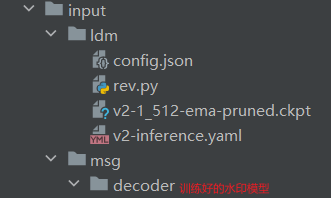

## hidden参数传递

使用了coco测试集。

参数示例：

```
torchrun --nproc_per_node=8 main.py \
  --val_dir path/to/coco/test2014/ --train_dir path/to/coco/train2014/ --output_dir output --eval_freq 5 \
  --img_size 256 --num_bits 48  --batch_size 16 --epochs 300 \
  --scheduler CosineLRScheduler,lr_min=1e-6,t_initial=300,warmup_lr_init=1e-6,warmup_t=5  --optimizer Lamb,lr=2e-2 \
  --p_color_jitter 0.0 --p_blur 0.0 --p_rot 0.0 --p_crop 1.0 --p_res 1.0 --p_jpeg 1.0 \
  --scaling_w 0.3 --scale_channels False --attenuation none \
  --loss_w_type bce --loss_margin 1 
```

需要创建一个文件夹output存放checkpoints。

## finetune 参数传递

使用了coco测试集。

需要创建input文件夹，内容如下：



需要传入的参数：

```
--num_keys
1
--ldm_config
input/ldm/v2-inference.yaml
--ldm_ckpt
input/ldm/v2-1_512-ema-pruned.ckpt
--msg_decoder_path
input/msg/decoder/dec_48b_whit.torchscript.pt #放的我们训练好的白化后模型
--train_dir
input/train/
--val_dir
input/test/
```

下载地址：

v2-inference.yaml：https://github.com/Stability-AI/stablediffusion/tree/main/configs/stable-diffusion

v2-1_512-ema-pruned.ckpt：https://huggingface.co/stabilityai/stable-diffusion-2-1-base/tree/main

训练测试集：coco：https://cocodataset.org/ 
